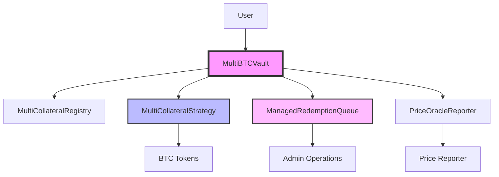

# Multi-Collateral BTC Vault Security Audit Package

## System Overview

The FountFi Multi-Collateral BTC Vault is an ERC-4626 compliant vault system that allows users to deposit multiple types of BTC collateral (WBTC, tBTC, sovaBTC) and receive mcBTC shares representing their proportional ownership in the vault. The system implements a 14-day redemption queue for withdrawals and uses manual price oracle updates for NAV management.

## Architecture

### Core Components



### Contract Hierarchy

1. **MultiBTCVault** (Main Entry Point)
   - Inherits: ERC4626, AccessControlEnumerable, Pausable, ReentrancyGuard
   - Purpose: User-facing vault for deposits and share management
   - Key Features: Multi-collateral deposits, mcBTC share issuance, redemption initiation

2. **MultiCollateralStrategy** (Asset Management)
   - Purpose: Holds and manages multiple BTC collateral types
   - Key Features: Collateral accounting, withdrawal processing, rebalancing support

3. **ManagedRedemptionQueue** (Withdrawal Management)
   - Purpose: Manages 14-day redemption waiting period
   - Key Features: Queue management, share custody, batch processing

4. **MultiCollateralRegistry** (Collateral Configuration)
   - Purpose: Tracks supported collateral types and conversion rates
   - Key Features: Decimal normalization, collateral validation

5. **PriceOracleReporter** (NAV Management)
   - Purpose: Manual price updates for yield tracking
   - Key Features: Gradual price transitions, manipulation protection

## Key Invariants

### System-Wide Invariants

1. **Share Supply Consistency**
   ```
   totalSupply(mcBTC) == sum(all user balances) + sum(shares in redemption queue)
   ```

2. **Asset Backing**
   ```
   totalAssets() >= totalSupply() * pricePerShare
   ```

3. **Collateral Conservation**
   ```
   sum(strategy collateral in BTC terms) >= vault reported assets
   ```

4. **Redemption Queue Integrity**
   ```
   sum(pending redemptions) <= strategy available liquidity
   ```

5. **Decimal Consistency**
   ```
   All internal calculations use 18 decimals (normalized)
   ```

### Critical Security Properties

1. **No Token Loss**: Tokens cannot be permanently locked or lost
2. **No Unauthorized Access**: All privileged functions require appropriate roles
3. **No Price Manipulation**: Oracle updates are gradual and controlled
4. **No Reentrancy**: All external calls protected by reentrancy guards
5. **No Integer Overflow**: Using Solidity 0.8.25 with built-in overflow protection

## Decimal Handling

### Conversion Matrix

| Token    | Native Decimals | Normalized (18) | Conversion Factor |
|----------|----------------|-----------------|-------------------|
| WBTC     | 8              | 18              | 1e10              |
| tBTC     | 18             | 18              | 1                 |
| sovaBTC  | 18             | 18              | 1                 |
| mcBTC    | 18             | 18              | 1                 |

### Critical Decimal Operations

1. **Deposit Conversion**
   ```solidity
   normalizedAmount = amount * 10**(18 - tokenDecimals)
   shares = normalizedAmount * totalSupply / totalAssets
   ```

2. **Redemption Conversion**
   ```solidity
   assets = shares * totalAssets / totalSupply
   tokenAmount = assets / 10**(18 - tokenDecimals)
   ```

## Access Control Matrix

| Role            | Functions                                          | Risk Level |
|-----------------|---------------------------------------------------|------------|
| DEFAULT_ADMIN   | All administrative functions                      | CRITICAL   |
| OPERATOR        | Process redemptions, update prices                | HIGH       |
| PAUSER          | Pause/unpause vault operations                   | HIGH       |
| REPORTER        | Update price oracle                              | MEDIUM     |
| MANAGER         | Add/remove collateral types                      | MEDIUM     |

## Testing Coverage

### Test Statistics
- Total Tests: 509
- Pass Rate: 100%
- Coverage Types: Unit, Integration, Fuzz, Load

### Critical Path Coverage
- ✅ Multi-collateral deposits
- ✅ Share calculations with different decimals
- ✅ Redemption queue operations
- ✅ Emergency controls
- ✅ Price oracle updates
- ✅ Admin operations
- ✅ Edge cases (minimum amounts, decimal precision)

## Known Risks and Mitigations

### Risk Matrix

| Risk                      | Severity | Likelihood | Mitigation                           |
|---------------------------|----------|------------|--------------------------------------|
| Liquidity shortage        | HIGH     | MEDIUM     | Emergency pause, forced processing  |
| Oracle manipulation       | HIGH     | LOW        | Gradual updates, role restriction   |
| Decimal rounding errors   | MEDIUM   | LOW        | Extensive testing, favor vault      |
| Reentrancy attacks       | HIGH     | LOW        | ReentrancyGuard on all functions   |
| Admin key compromise     | CRITICAL | LOW        | Multi-sig, time delays planned      |

## Audit Focus Areas

### Priority 1: Critical Security
1. Decimal handling in multi-collateral conversions
2. Share calculation accuracy
3. Redemption queue share custody
4. Emergency control effectiveness
5. Access control implementation

### Priority 2: Economic Security
1. NAV calculation correctness
2. Price oracle manipulation resistance
3. MEV attack vectors
4. Liquidity management
5. Fee extraction possibilities

### Priority 3: Operational Security
1. Upgrade patterns (currently immutable)
2. Admin operation safety
3. Pause/unpause implications
4. Token rescue functionality
5. Queue processing fairness

## External Dependencies

### OpenZeppelin Contracts (v5.0.0)
- ERC4626 (vault standard)
- AccessControlEnumerable (roles)
- Pausable (emergency controls)
- ReentrancyGuard (reentrancy protection)
- SafeERC20 (token transfers)

### Solidity Version
- Compiler: 0.8.25
- Optimizer: Enabled (200 runs)

## Deployment Information

### Base Sepolia (Testnet)
- Chain ID: 84532
- Vault: `0x73E27097221d4d9D5893a83350dC7A967b46fab7`
- Queue: `0x22BC73098CE1Ba2CaE5431fb32051cB4fc0F9C52`
- Strategy: `0x740907524EbD6A481a81cE76B5115A4cDDb80099`
- Registry: `0x15a9983784617aa8892b2677bbaEc23539482B65`
- Oracle: `0xDB4479A2360E118CCbD99B88e82522813BDE48f5`

### Planned Mainnet Networks
- Base
- Ethereum
- Arbitrum
- Optimism

## Contact Information

**Project Team**: FountFi Development Team
**Technical Lead**: [Contact Information]
**Security Contact**: security@fountfi.io
**Documentation**: https://docs.fountfi.io
**GitHub**: https://github.com/fountfi/sovabtc

## Audit Deliverable Expectations

We request the following from the audit:

1. **Vulnerability Assessment**: Identify all security vulnerabilities with severity ratings
2. **Code Quality Review**: Assess code quality, gas optimization, and best practices
3. **Economic Analysis**: Review economic attack vectors and game theory
4. **Recommendations**: Provide specific remediation steps for all findings
5. **Fix Verification**: Re-review after fixes are implemented

## Additional Resources

- [CONTRACTS.md](./CONTRACTS.md) - Detailed contract descriptions
- [INVARIANTS.md](./INVARIANTS.md) - Complete invariant specifications
- [ATTACK_VECTORS.md](./ATTACK_VECTORS.md) - Known attack scenarios
- [TEST_COVERAGE.md](./TEST_COVERAGE.md) - Full test reports
- [DEPENDENCIES.md](./DEPENDENCIES.md) - External dependency analysis
- [ACCESS_CONTROL.md](./ACCESS_CONTROL.md) - Role permissions details
- [DECIMAL_HANDLING.md](./DECIMAL_HANDLING.md) - Precision documentation
- [EMERGENCY_PROCEDURES.md](./EMERGENCY_PROCEDURES.md) - Incident response
- [DEPLOYMENT_GUIDE.md](./DEPLOYMENT_GUIDE.md) - Deployment instructions
- [SLITHER_REPORT.md](./SLITHER_REPORT.md) - Automated security analysis
- [KNOWN_ISSUES.md](./KNOWN_ISSUES.md) - Acknowledged limitations